---
## Front matter
lang: ru-RU
title: Отчет по лабораторной работе  №11
subtitle: Операционные системы
author:
  -  Никитенко Арина Александровна
institute:
  - Российский университет дружбы народов, Москва, Россия

## i18n babel
babel-lang: russian
babel-otherlangs: english

## Formatting pdf
toc: false
toc-title: Содержание
slide_level: 2
aspectratio: 169
section-titles: true
theme: metropolis
header-includes:
 - \metroset{progressbar=frametitle,sectionpage=progressbar,numbering=fraction}
---

# Информация

## Докладчик

  * Никитенко Арина Александровна
  * НКАбд-07-25, Студенческий билет: 1132250435
  * Российский университет дружбы народов

## Цель работы

Познакомиться с операционной системой Linux. Получить практические навыки работы с редактором Emacs

---

## Выполнение лабораторной работы

 1.1 Открытие emacs

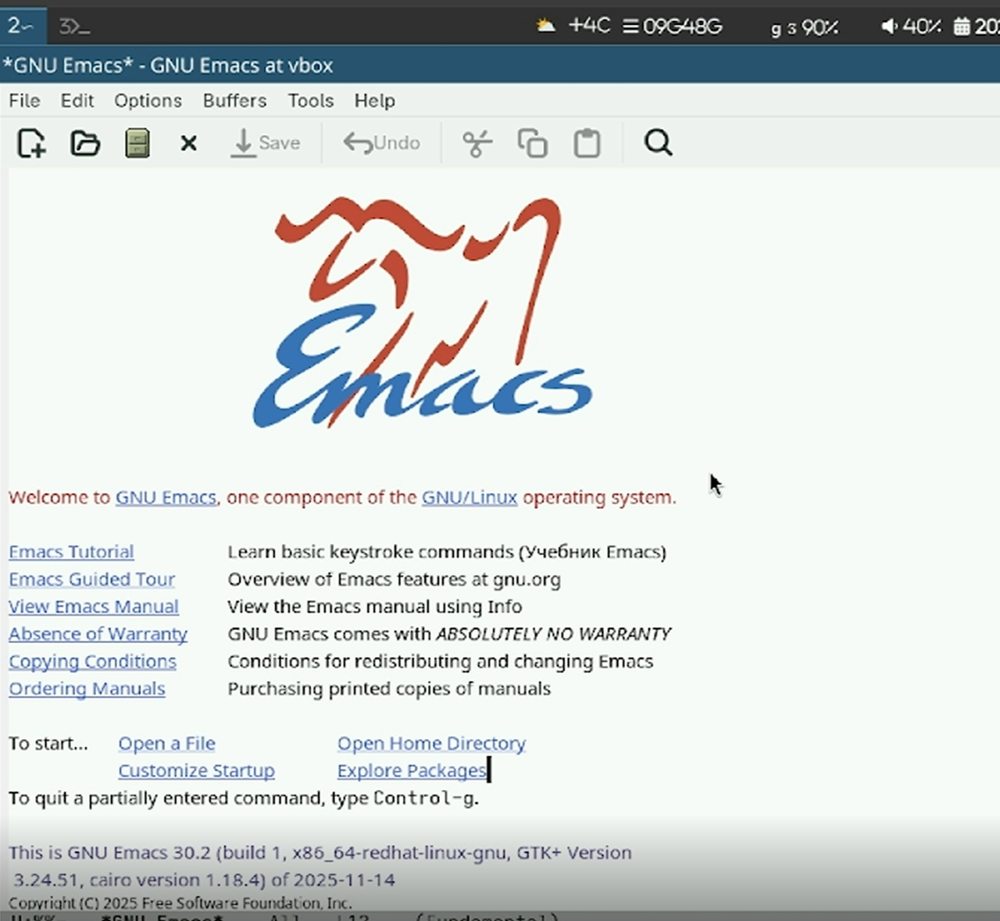{#fig-001 width=70%}

##

1.2 Cоздание файла  lab07.sh и заполнение его текстом и сохранение

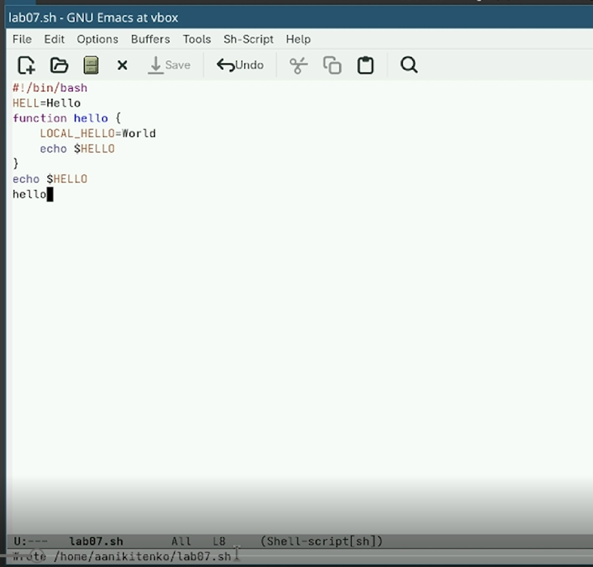{#fig-002 width=70%}

##

1.3 Проделываем с текстом стандартные процедуры редактирования, каждое действие долж-
но осуществляться комбинацией клавиш. Вырезаем одной командой целую строку (С-k).

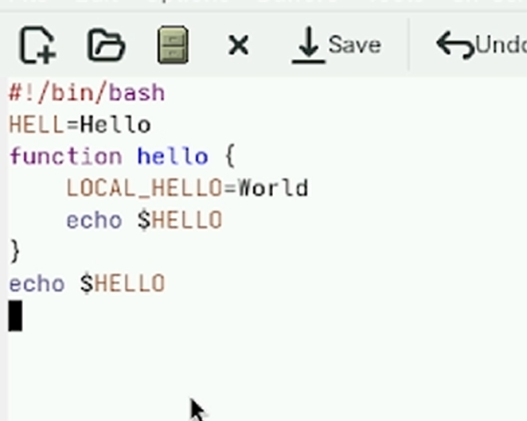{#fig-003 width=70%}

##

1.4 Вырезали текст,скопировали и вставили в конец файла и еще строчку вставили в конец файла(которую ранее вычрезали)

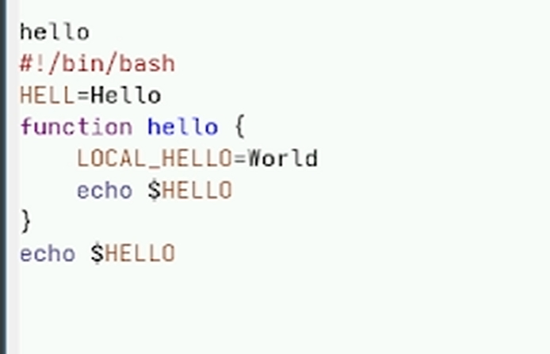{#fig-004 width=70%}

##

1.5 Перемещение  в начале строки

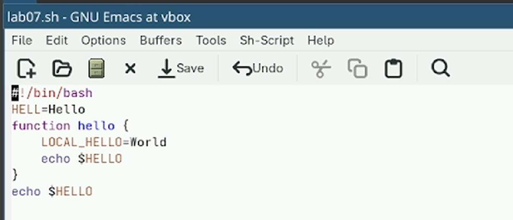{#fig-005 width=70%}

##

1.6 Перемещение в конец строки

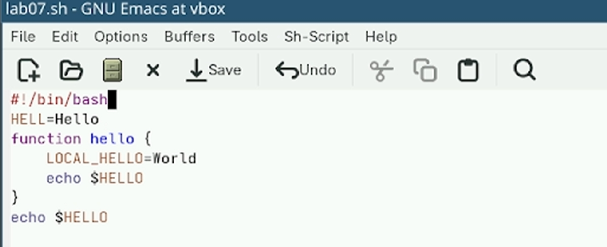{#fig-006 width=70%}

##

1.7 Перемещение курсор в начало буфера (M-<).

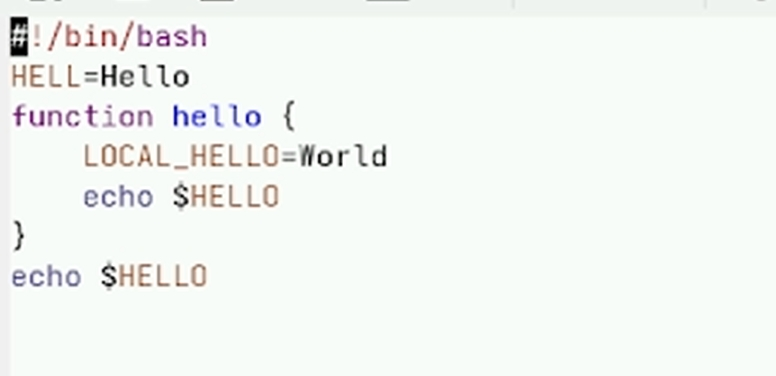{#fig-007 width=70%}

##

#1.8 Перемещение курсор в конец буфера (M->).

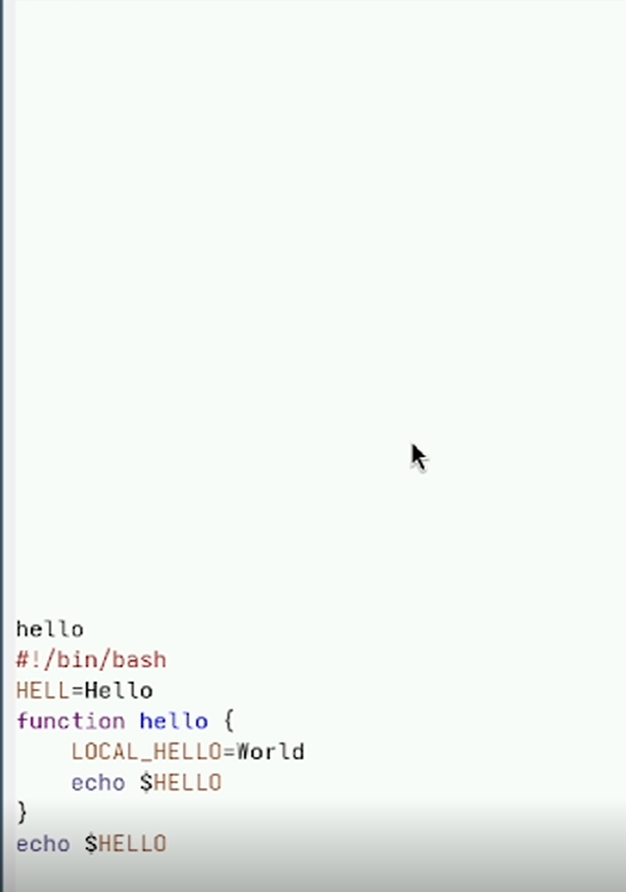{#fig-008 width=70%}

##

1.9 Показ список буферов

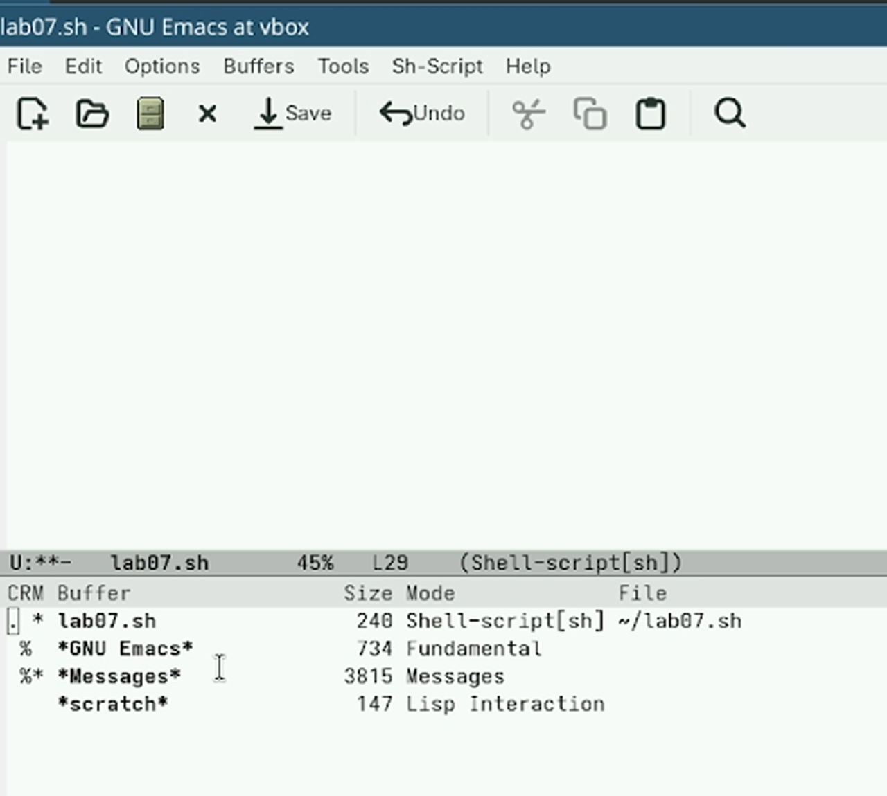{#fig-009 width=70%}

##

1.10  Переместиться в окно со списком буферов

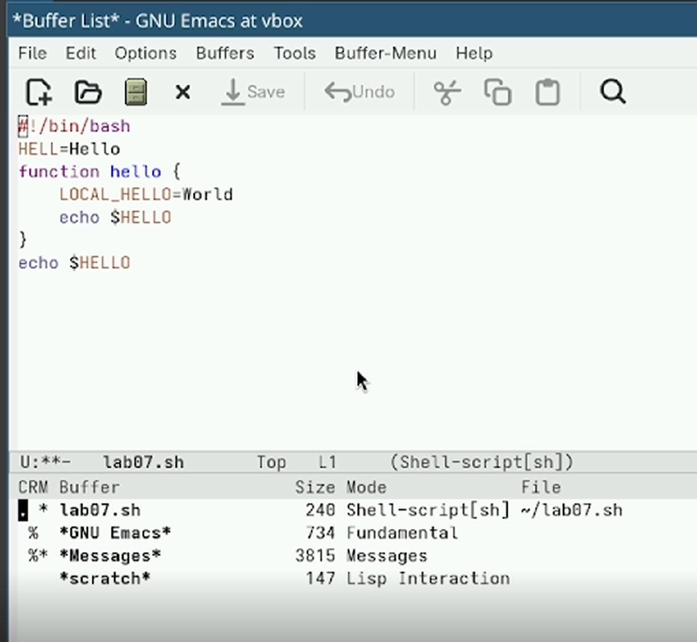{#fig-010 width=70%}

##

1.11 переключится на другой буфер(scratch)

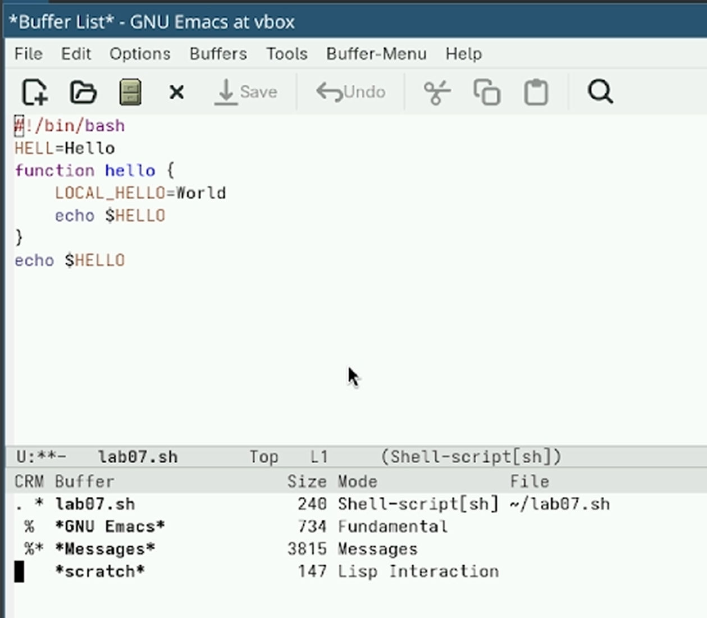{#fig-011 width=70%}

##

1.12 разделили окно по вертикали(лево/право)

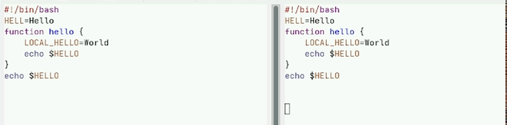{#fig-012 width=70%}

##

 1.13 разделили окно на 4 части.В каждом из окно открыли новый буфер.Написали в каждом окне текст

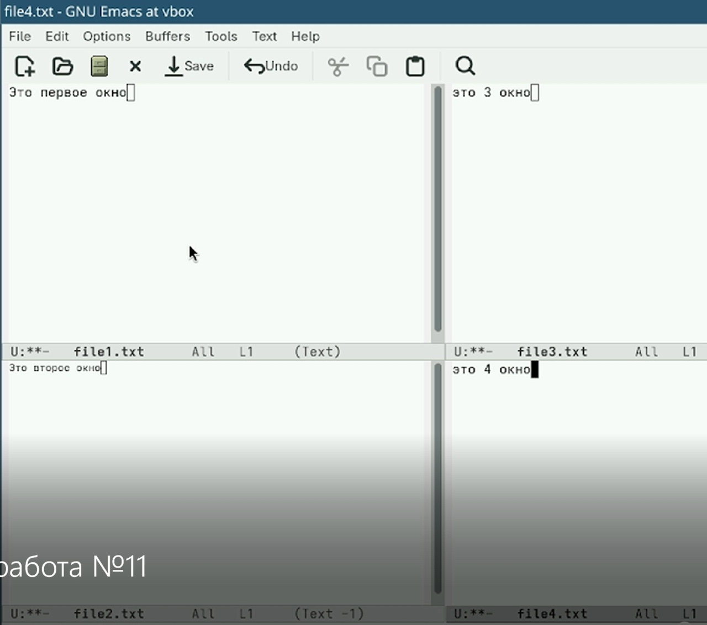{#fig-013 width=70%}

##

1.14 Переключаемся в режим поиска (C-s) и находим несколько слов, присутствующих в тексте.

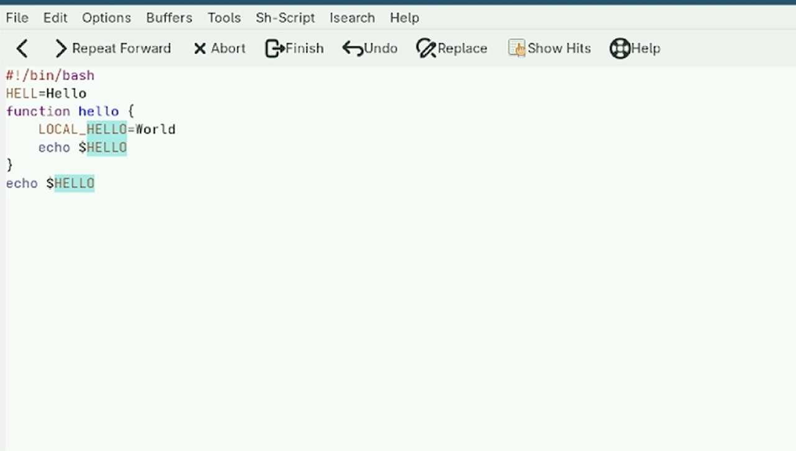{#fig-014 width=70%}

##

1.15 поиск HELLO и замена на HI

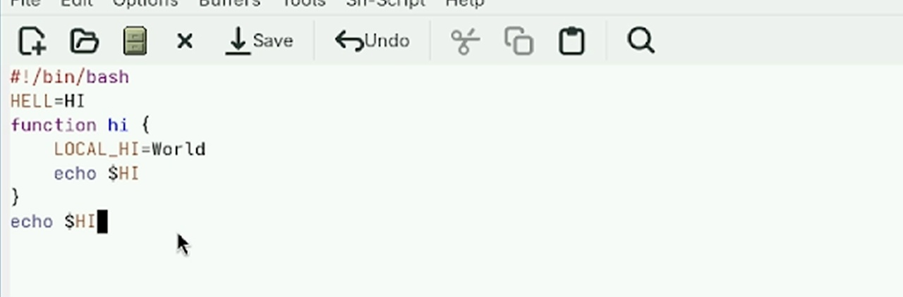{#fig-015 width=70%}

##

# Вывод
Мы ознакомились с операционной системой Linux. Получмли практические навыки работы с редактором Emacs

# Контрольные вопросы
Ответы на контрольные вопросы по лабораторной работе №9 (Emacs)

1. Кратко охарактеризуйте редактор emacs.
Emacs — это мощный расширяемый текстовый редактор с открытым исходным кодом. Он написан на языке Elisp и позволяет не только редактировать текст, но и работать с электронной почтой, отлаживать программы, читать документацию, играть в игры и многое другое. Emacs поддерживает работу с буферами, окнами и фреймами, имеет встроенную справочную систему и огромное количество режимов для разных языков программирования.

##

2. Какие особенности данного редактора могут сделать его сложным для освоения новичком?
Новичку сложно освоить Emacs по следующим причинам: нестандартные сочетания клавиш (вместо привычных Ctrl+C, Ctrl+V используются комбинации с префиксами C-x, C-c, M-); отсутствие на клавиатуре клавиши Meta (вместо неё приходится использовать Alt или Esc); большое количество команд и функций, в котором легко запутаться; собственная терминология (буфер, фрейм, минибуфер, точка вставки); необходимость запоминать последовательности нажатий клавиш.

##

3. Своими словами опишите, что такое буфер и окно в терминологии emacs’а.
Буфер — это область памяти, в которой хранится какой-либо текст. Это может быть открытый файл, результат выполнения команды, встроенная подсказка или системное сообщение. Окно — это прямоугольная область на экране, в которой отображается содержимое одного буфера. В одном окне можно по очереди просматривать разные буферы, а также можно разделить экран на несколько окон, чтобы видеть несколько буферов одновременно.

##

4. Можно ли открыть больше 10 буферов в одном окне?
Да, можно. Количество буферов, которые можно открыть в Emacs, ограничено только объёмом оперативной памяти компьютера. В одном окне можно переключаться между любым количеством буферов с помощью команды C-x b.

##

5. Какие буферы создаются по умолчанию при запуске emacs?
При запуске Emacs по умолчанию создаются следующие буферы: буфер приветствия (обычно называется *GNU Emacs*), буфер *scratch* для быстрых записей и выполнения выражений Elisp, буфер *Messages* для вывода системных сообщений и ошибок. Если вызвать справку, также появляется буфер *Help*.

##

6. Какие клавиши вы нажмёте, чтобы ввести следующую комбинацию C-c | и C-c C-|?
Для ввода комбинации C-c | нужно: зажать Ctrl, нажать клавишу C, отпустить обе клавиши, затем нажать клавишу | (вертикальная черта). На русской клавиатуре вертикальная черта вводится с помощью Shift + \ (обратный слеш, клавиша над Enter). Для ввода комбинации C-c C-| нужно: зажать Ctrl, нажать C, отпустить, затем снова зажать Ctrl и, удерживая его, нажать клавишу |.

##

7. Как поделить текущее окно на две части?
Чтобы разделить текущее окно на две части по горизонтали (верхняя и нижняя часть), нужно нажать комбинацию C-x 2 (Ctrl+X, затем цифра 2). Чтобы разделить окно на две части по вертикали (левая и правая часть), нужно нажать комбинацию C-x 3 (Ctrl+X, затем цифра 3).

##

8. В каком файле хранятся настройки редактора emacs?
Настройки редактора Emacs хранятся в файле .emacs, который находится в домашней директории пользователя (~/.emacs). Также настройки могут храниться в файле init.el в папке ~/.emacs.d/. Если этих файлов нет, пользователь может создать их самостоятельно.

##

9. Какую функцию выполняет клавиша и можно ли её переназначить?
В Emacs можно переназначить любую клавишу или комбинацию клавиш. Это делается с помощью настройки в файле ~/.emacs. Например, для переназначения комбинации C-s (по умолчанию поиск) на сохранение файла, нужно добавить в файл настроек строку: (global-set-key (kbd "C-s") 'save-buffer). Таким образом, Emacs позволяет полностью настроить клавиатуру под свои потребности. (Если вопрос подразумевал конкретную клавишу, например C-g, то она выполняет отмену текущей операции.)

##

10. Какой редактор вам показался удобнее в работе vi или emacs? Поясните почему.
Мне показался удобнее редактор Emacs. Во-первых, в Emacs нет модальности, то есть не нужно постоянно переключаться между режимом ввода и командным режимом, как в vi. Во-вторых, в Emacs есть удобное меню, которое можно вызвать клавишей F10, что помогает новичку, когда он забыл нужную комбинацию клавиш. В-третьих, встроенная справочная система и интерактивный учебник (C-h t) позволяют быстро освоить основные приёмы работы. Поэтому для повседневной работы я выбираю Emacs.

