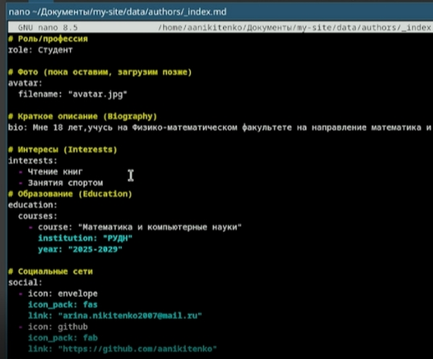
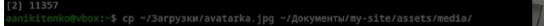
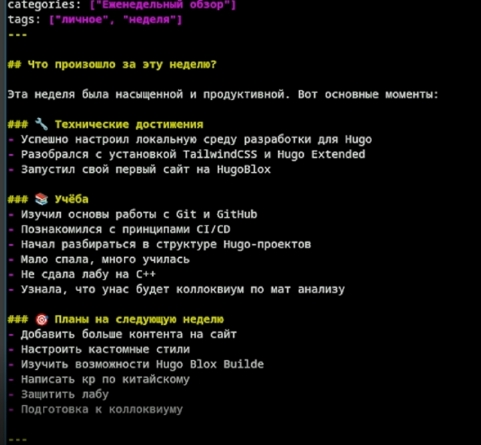
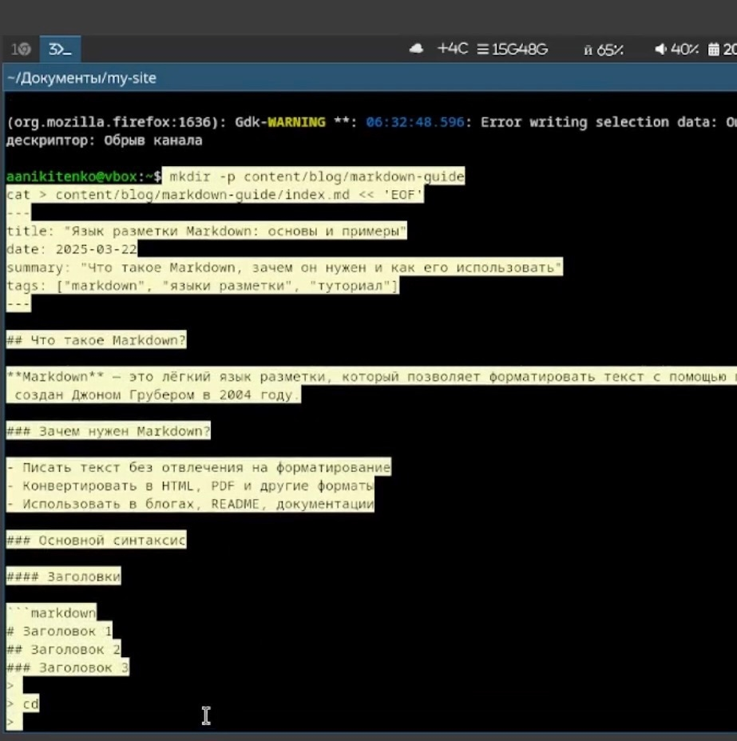
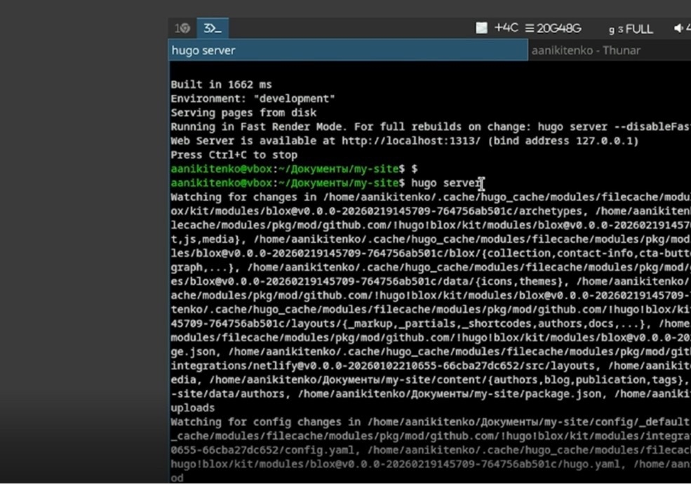
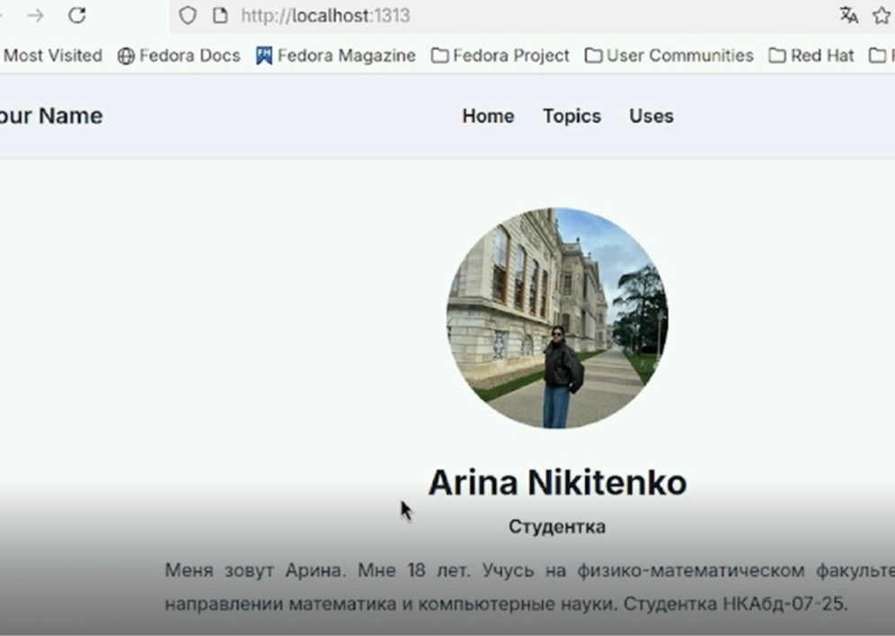
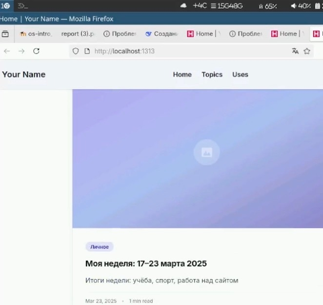
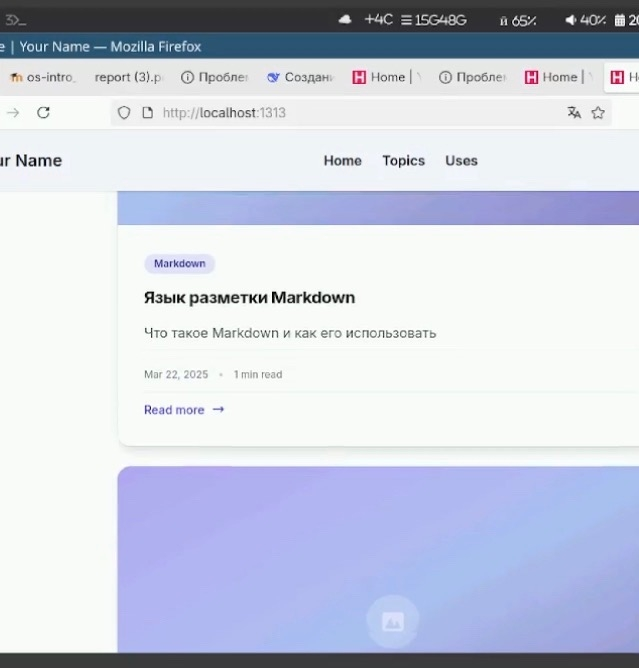

---
## Front matter
lang: ru-RU
title: Проект этап №2
subtitle: Операционные системы
author:
  - Никитенко Арина
institute:
  - Российский университет дружбы народов, Москва, Россия

## i18n babel
babel-lang: russian
babel-otherlangs: english

## Formatting pdf
toc: false
toc-title: Содержание
slide_level: 2
aspectratio: 169
section-titles: true
theme: metropolis
header-includes:
 - \metroset{progressbar=frametitle,sectionpage=progressbar,numbering=fraction}
---

# Информация

## Докладчик

  * Никитенко Арина Александровна
  * НКАбд-07-25, Студенческий билет: 1132250435
  * Российский университет дружбы народов

## Цель работы
Добавить к сайту достижения о себе.

---

## Выполнение проекта

##
1.Добавить к сайту данные о себе.

{#fig-001 width=70%}

##

{#fig-002 width=70%}

##

 {#fig-003 width=70%}
 
##

 {#fig-004 width=70%}
 
##

{#fig-005 width=70%}

##

{#fig-006 width=70%}

##

{#fig-007 width=70%}

##

{#fig-008 width=70%}

## Выводы

Мы оформили сайт
