---
## Author
author:
  name: Никитенко Арина 
  degrees: DSc
  orcid: 0000-0002-0877-7063
  email: 1132250435@rudn.ru
  affiliation:
    - name: Российский университет дружбы народов
      country: Российская Федерация
      postal-code: 117198
      city: Москва
      address: ул. Миклухо-Маклая, д. 6

## Title
title: "Отчёт лабараторная работа №6"
subtitle: "Архитектура компьютеров и операционные системы "
license: "CC BY"
---

# Цель работы

Приобрести практические навыки взаимодействия пользователя с системой посредством командной строки.

# Задание

1.Определяем полное имя домашнего каталога.

{#fig-001 width=70%}

2.Выполняем следующие действия.

2.1 Переход в каталог tmp

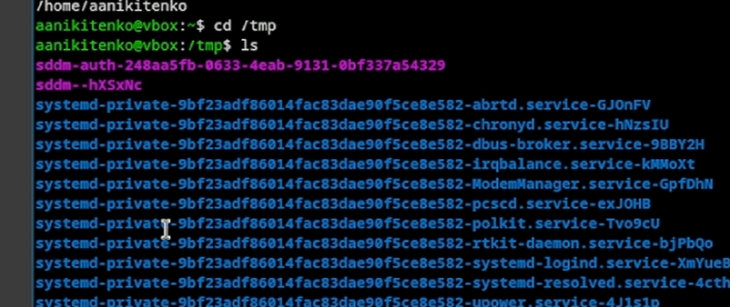{#fig-002 width=70%}

2.2 Вывод содержания каталога /tmp.Для этого используем команду ls с разными опциями.

 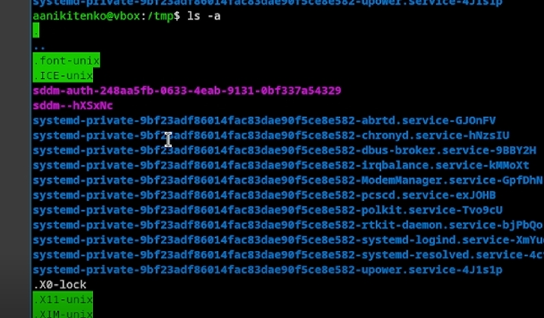{#fig-003 width=70%}

 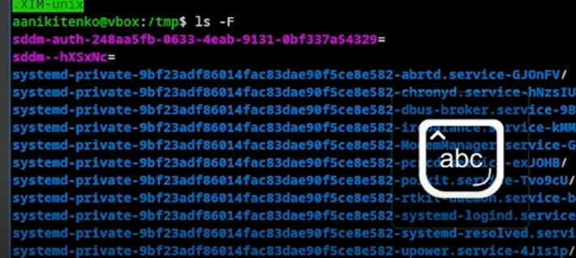{#fig-004 width=70%}

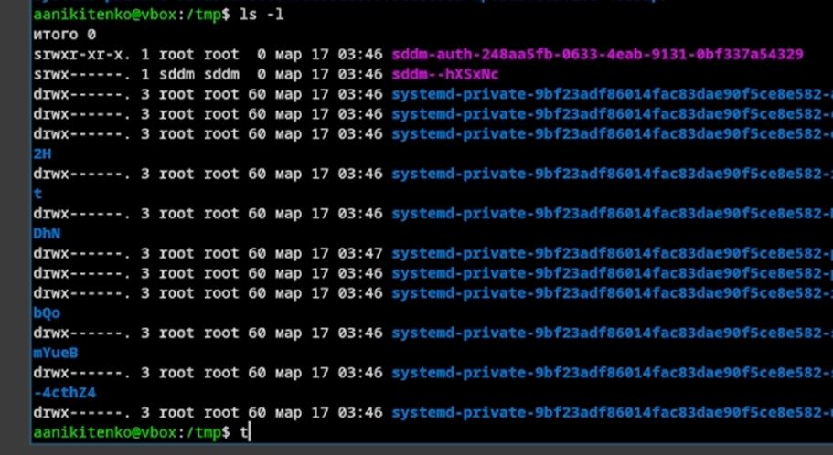{#fig-005 width=70%}

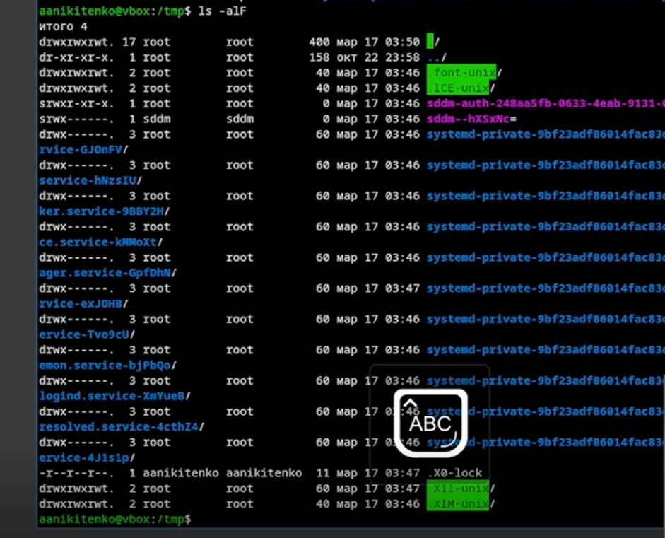{#fig-006 width=70%}

2.3-2.4 Определяем есть ли в каталоге  /var/spool подкаталог с именем cron и переходим в домашний каталог, выводим содержимае на экран и определяем кто владелец 

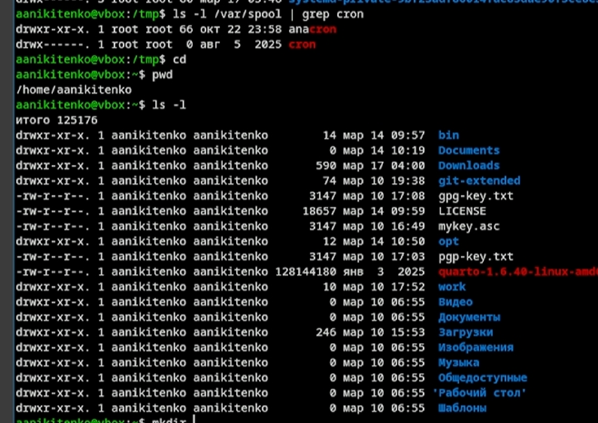{#fig-007 width=70%}

3.1 В домашнем каталоге создаём новый каталог newdir

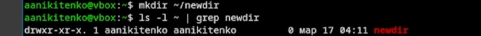{#fig-008 width=70%}

3.2 В каталоге ~/newdir создаём новый каталог morefun

{#fig-009 width=70%}

3.3 В домашнем каталоге создайте одной командой три новых каталога с именами
letters, memos, misk. Затем удаляем эти каталоги одной командой. и проверяем удалился ли

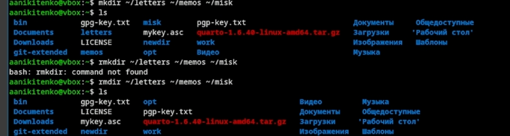{#fig-010width=70%}

3.4 Попробуем  удалить ранее созданный каталог ~/newdir командой rm. Проверяем, был ли каталог удалён . Нет, каталог не удален

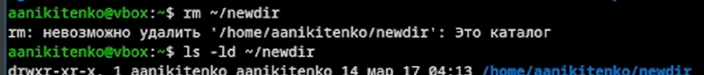{#fig-011 width=70%}

3.5 Удаляем каталог ~/newdir/morefun из домашнего каталога и проверяем был ли удалён каталог.

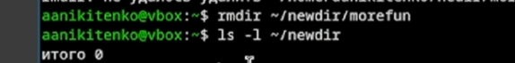{#fig-012 width=70%}

4. С помощью команды man определяем,какую опцию команды ls нужно использовать для просмотра содержимого  не только указанного каталога, но и подкаталогов,входящего в него.

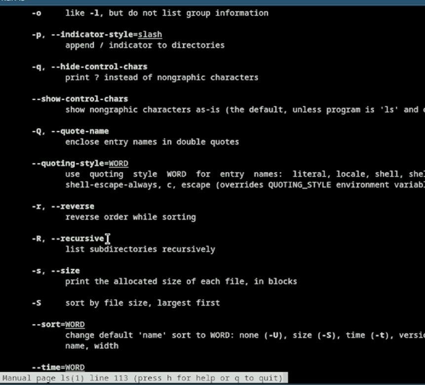{#fig-013 width=70%}

{#fig-014 width=70%}

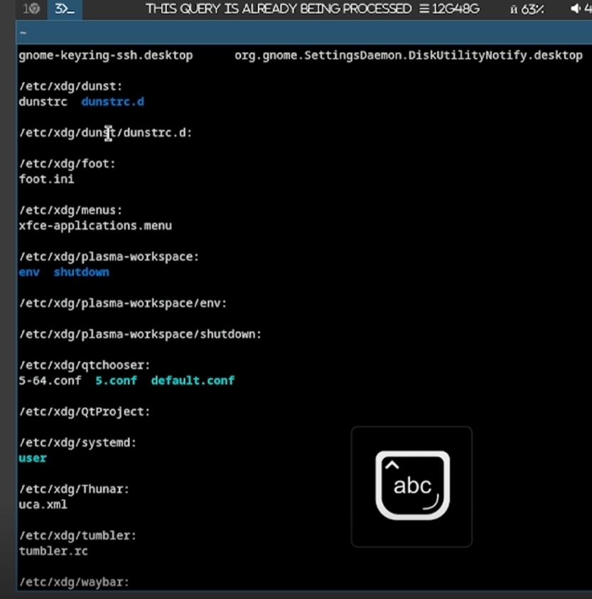{#fig-015 width=70%}

5.С помощью команды man определяем набор опций команды ls, позволяющий отсортировать по времени последнего изменения выводимый список содержимого каталога с развёрнутым описанием файлов.

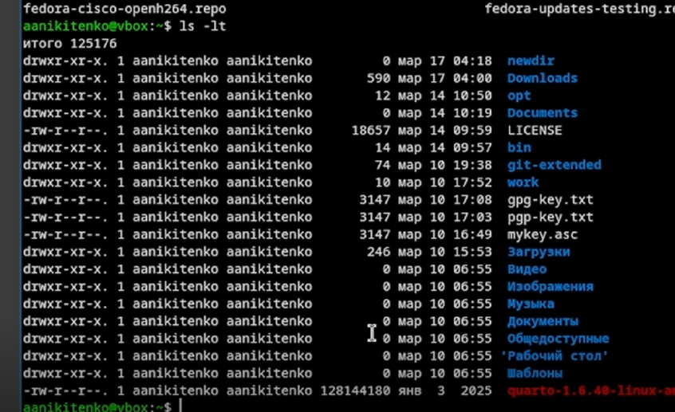{#fig-016 width=70%}

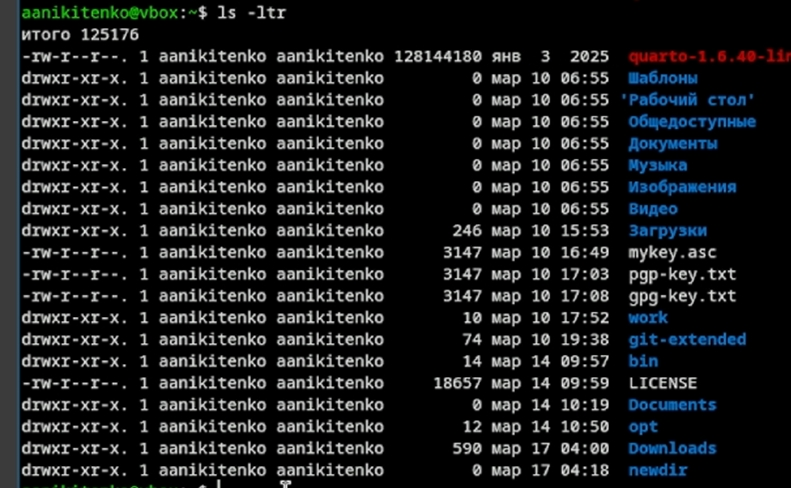{#fig-017 width=70%}

6.Используем команду man для просмотра описания команд: cd,pwd,mkdir,rmdir,rm. И поясняем.

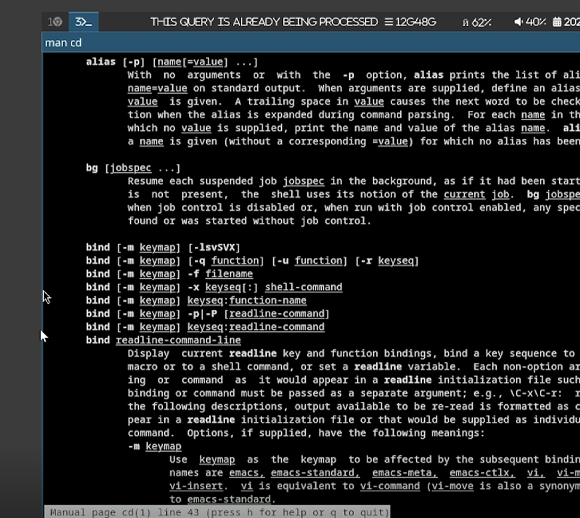{#fig-018 width=70%}

{#fig-019 width=70%}

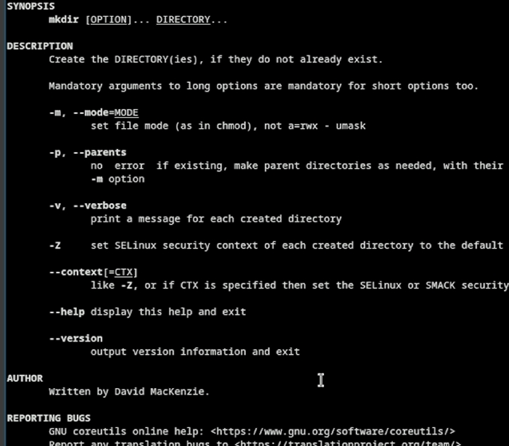{#fig-020 width=70%}

{#fig-021 width=70%}

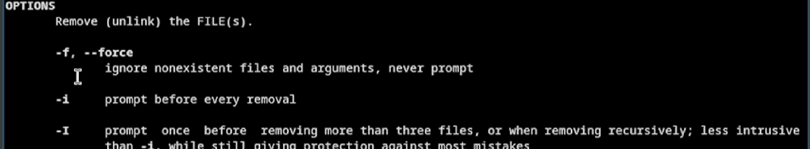{#fig-022 width=70%}

7. Используя информацию, полученную при помощи команды history, выполняем модификацию и исполнение нескольких команд из буфера команд.

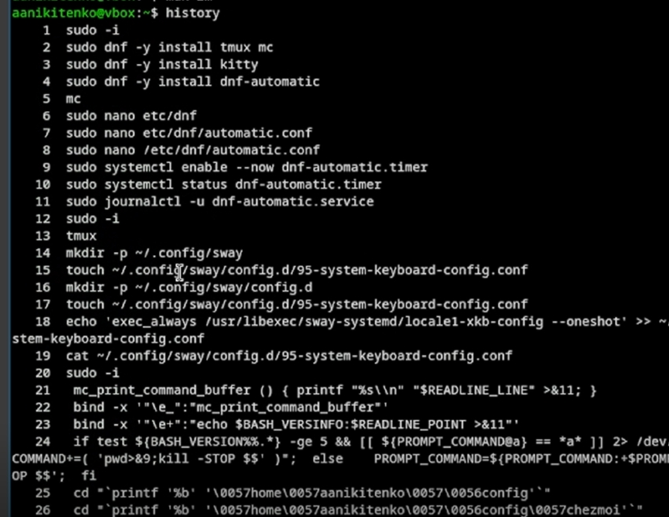{#fig-023 width=70%}

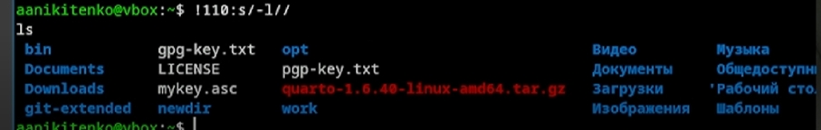{#fig-024 width=70%}

# Выводы

Мы научились оформлять отчёты с помощью Markdown
 

# Контрольные вопросы 

1.Командная строка — это интерфейс взаимодействия пользователя с операционной системой, при котором команды вводятся в виде текстовых строк. Пользователь вводит команды с клавиатуры, и система их выполняет. В Unix-подобных системах командная строка реализуется через командные интерпретаторы (shell), такие как /bin/sh, /bin/bash, /bin/csh, /bin/ksh.

2.Для определения абсолютного пути текущего каталога используется команда pwd (print working directory).(Пример: pwd
Результат: /home/aanikitenko/documents)

3.Для определения типа файлов и их имён используется команда ls с опцией -F (или --classify). Эта опция добавляет к именам файлов символы, обозначающие тип: / для каталогов, * для исполняемых файлов, @ для символических ссылок.(Пример ls -F 
Результат Documents/ script.sh* file.txt )

4.Для отображения скрытых файлов (имена которых начинаются с точки) используется команда ls с опцией -a (all).
(Пример ls -a Результат ..font-unix ....ICE-unix )

5.Для удаления файлов используется команда rm. Для удаления пустых каталогов используется команда rmdir. Для удаления непустых каталогов используется команда rm с опцией -r (рекурсивно).

Да, можно удалить файл и каталог одной командой. Команда rm с опцией -r может удалять и файлы, и каталоги (включая их содержимое).
Примеры:rm file.txt  rmdir empty_dir  rm -r nonempty_dir
rm -r file.txt directory/
8086
www.8086.net
6.Для вывода списка ранее выполненных команд используется команда history.
Пример:
history
Результат: 1 pwd2 cd /tmp 3 ls -la 4. cd ~ 5 mkdir newdir

7.Для модифицированного выполнения команд из истории используется конструкция: !<номер_команды>:s/<что_меняем>/<на_что_меняем>
Пример:
4:s/newdir/olddir (заменяет "newdir" на "olddir")

8.Для последовательного выполнения нескольких команд в одной строке используется символ ; (точка с запятой).

Примеры:
cd; ls
pwd; ls -la; cd /tmp

9.Экранирование — это способ использования специальных символов как обычных, без их специального значения. В командной строке для экранирования используется обратный слеш .

Пример touch файл\ с\ пробелами.txt (создание файла с пробелом)

10.Команда ls -l выводит подробную информацию о файлах и каталогах в следующем формате: тип файла, права доступа, количество ссылок, владелец, группа, размер в байтах, дата и время последнего изменения, имя файла или каталога.

Пример:
-rw-r--r-- 1 user group 1024 Apr 15 10:30 file.txt

11.Относительный путь — это путь относительно текущего каталога. Он не начинается с / и использует обозначения: . для текущего каталога и .. для родительского каталога.

Абсолютный путь — это полный путь от корневого каталога (/) до файла или каталога, который всегда начинается с /.

Примеры (при нахождении в каталоге /home/aanikitenko):
Абсолютный путь: ls /home/aanikitenko/documents/report.txt
Абсолютный путь: cd /var/log

12.Для получения информации о команде используется команда man (manual). Формат: man <команда>. Для управления просмотром используются клавиши: Space (страница вперёд), Enter (строка вперёд), q (выход).

Примеры:man ls man cd

13.Для автоматического дополнения вводимых команд используется клавиша Tab (табуляция). При вводе начала имени команды или файла нажатие Tab автоматически дополняет имя, если оно однозначно определено. Если есть несколько вариантов, повторное нажатие Tab показывает все возможные варианты. 
Пример: cd /hom + Tab → cd /home/

::: {#refs}
:::
