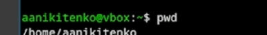
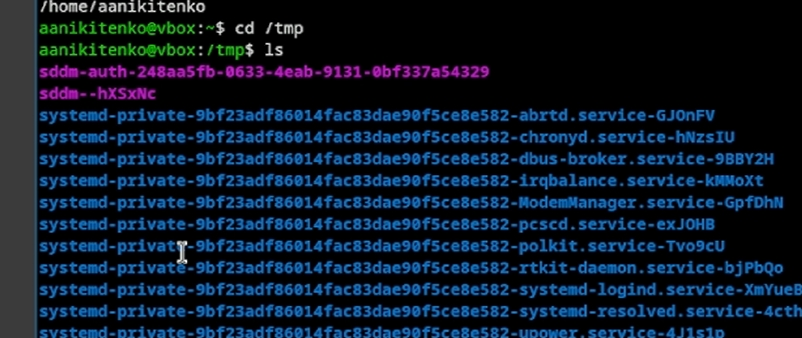
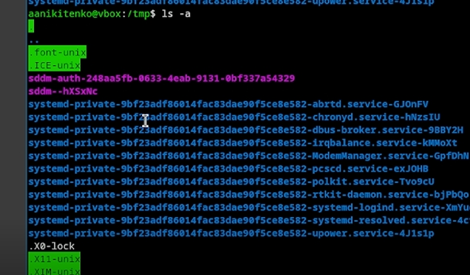
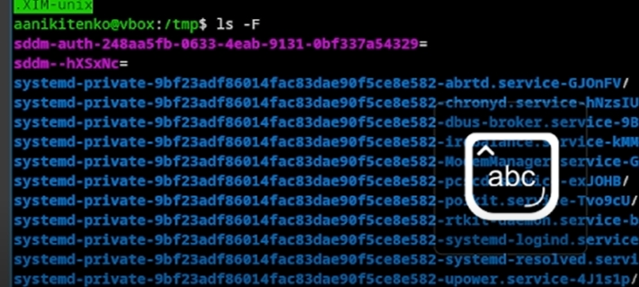
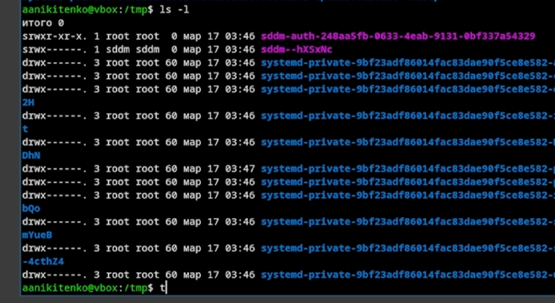
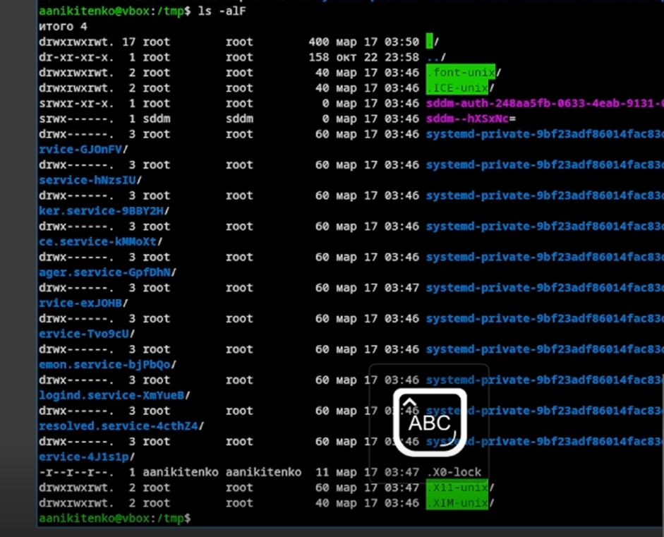
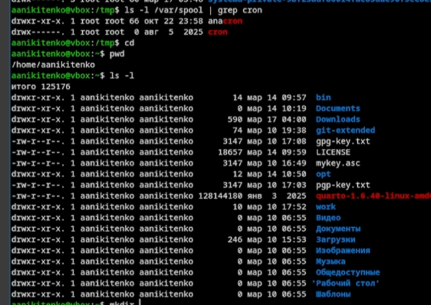
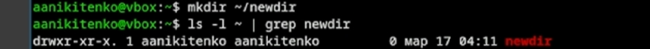

---
## Author
author:
  name: Никитенко Арина Александровна
  degrees: DSc
  orcid: 0000-0002-0877-7063
  email: 1132250435@rudn.ru
  affiliation:
    - name: Российский университет дружбы народов
      country: Российская Федерация
      postal-code: 117198
      city: Москва
      address: ул. Миклухо-Маклая, д. 6

## Title
title: "Проект этап №3"
subtitle: "Простейший вариант"
license: "CC BY"
---

# Цель работы
Добавить к сайту достижения о себе.

## Лабораторная работа

# 1. Этапы выполнения проекта

{ #fig:001 width=70% }

{ #fig:002 width=70% }

{ #fig:003 width=70% }

{ #fig:004 width=70% }

{ #fig:005 width=70% }

{ #fig:006 width=70% }

{ #fig:007 width=70% }

{ #fig:008 width=70% }

# Список литературы {#refs}

