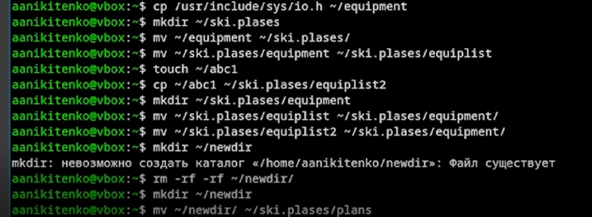
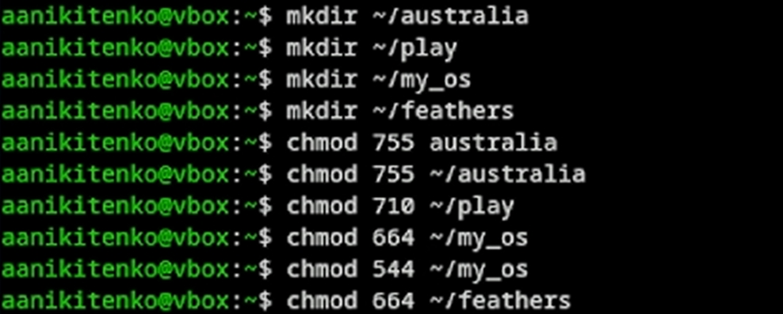
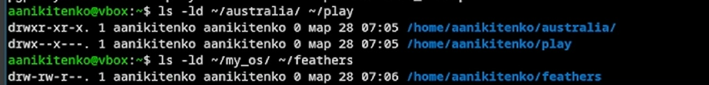
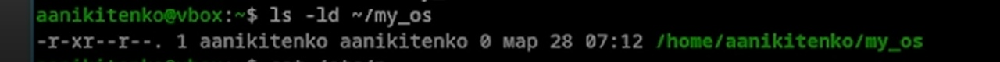
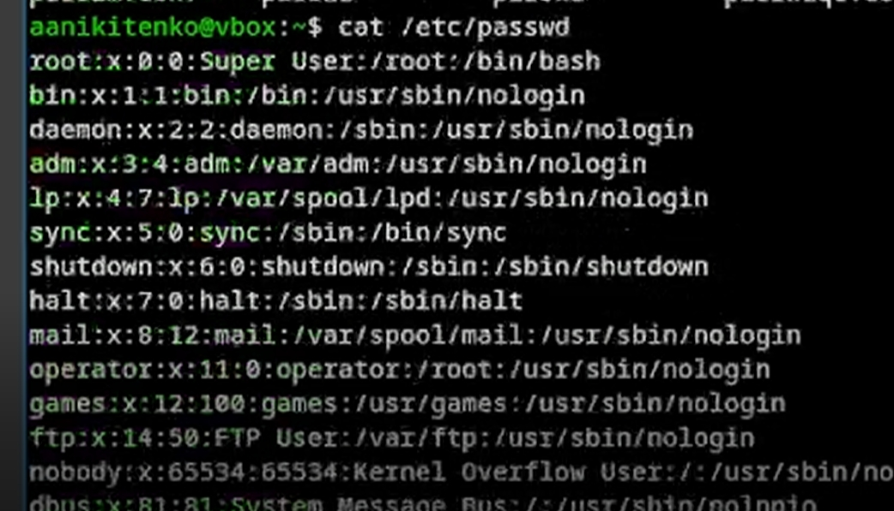
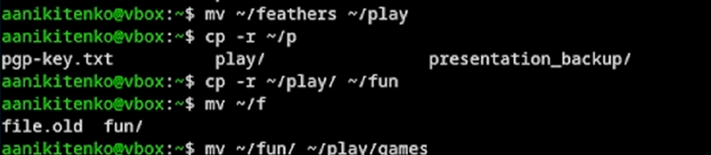
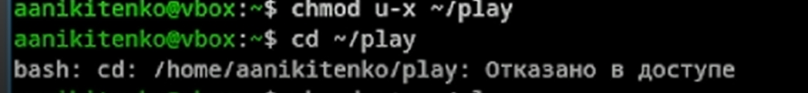
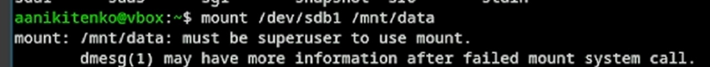
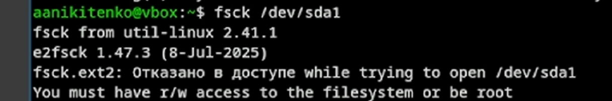
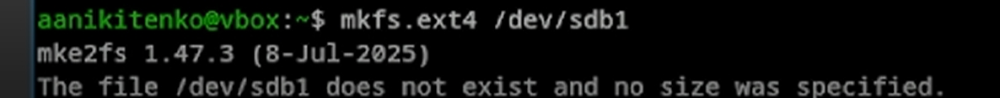

---
## Author
author:
  name: Никитенко Арина 
  degrees: DSc
  orcid: 0000-0002-0877-7063
  email: 1132250435@rudn.ru
  affiliation:
    - name: Российский университет дружбы народов
      country: Российская Федерация
      postal-code: 117198
      city: Москва
      address: ул. Миклухо-Маклая, д. 6

## Title
title: "Отчёт лабараторная работа №7"
subtitle: "Архитектура компьютеров и операционные системы "
license: "CC BY"
---

# Цель работы

Ознакомится с файловой системой Linux, её структурой, именами и содержанием
каталогов. Приобрести практические навыки по применению команд для работы
с файлами и каталогами, по управлению процессами (и работами), по проверке исполь-
зования диска и обслуживанию файловой системы.

# Задание

# 1.1 Скопируем файл /usr/include/sys/io.h в домашний каталог и назовём его
equipment. В домашнем каталоге создадим директорию ~/ski.plases.Переместим файл equipment в каталог ~/ski.plases.Переименуем файл ~/ski.plases/equipment в ~/ski.plases/equiplist.Создаём в домашнем каталоге файл abc1 и скопируем его в каталог ~/ski.plases, назовём его equiplist2.Создаём каталог с именем equipment в каталоге ~/ski.plases.Переместим файлы ~/ski.plases/equiplist и equiplist2 в каталог ~/ski.plases/equipment.
Создаём и перемещаем каталог ~/newdir в каталог ~/ski.plases и назовёмего plans.

{#fig-001 width=70%}

# 1.2 Определяем опции команды chmod, необходимые для того, чтобы присвоить перечисленным ниже файлам выделенные права доступа считая, что в начале таких прав
нет:
3.1. drwxr--r-- ... australia
3.2. drwx--x--x ... play
3.3. -r-xr--r-- ... my_os
3.4. -rw-rw-r-- ... feathers
При необходимости создадим нужные файлы.

{#fig-002 width=70%}

{#fig-003 width=70%}

{#fig-004 width=70%}

# 1.3 Проделаем приведённые ниже упражнения, записывая в отчёт по лабораторной работе используемые при этом команды

{#fig-005 width=70%}

{#fig-006 width=70%}

{#fig-007 width=70%}

{#fig-008 width=70%}

{#fig-009 width=70%}

{#fig-010 width=70%}

{#fig-011 width=70%}

{#fig-012 width=70%}

# 1.4 Проходимся man по командам mount, fsck, mkfs, kill и кратко их охарактеризуем, приведя примеры.

{#fig-013 width=70%}

{#fig-014 width=70%}

{#fig-015 width=70%}

{#fig-004 width=70%}

# Вывод

Мы ознакомились с файловой системой Linux, её структурой, именами и содержанием
каталогов. Приобрели практические навыки по применению команд для работы
с файлами и каталогами, по управлению процессами (и работами), по проверке исполь-
зования диска и обслуживанию файловой системы.

# Контрольные вопросы

 1.На жёстком диске компьютера могут быть различные файловые системы. ext4 — основная для Linux, поддерживает журналирование, файлы до 16 ТиБ. XFS — производительная, для больших файлов. btrfs — с расширенными возможностями (снапшоты, контрольные суммы). FAT32/NTFS — для совместимости с Windows. tmpfs, procfs, sysfs — виртуальные файловые системы.

 2.Корневая структура Linux: /bin — основные команды, /boot — загрузчик и ядро, /dev — устройства, /etc — конфигурации, /home — домашние каталоги пользователей, /lib — библиотеки, /media — сменные носители, /mnt — временное монтирование, /opt — дополнительное ПО, /proc — информация о процессах, /root — домашний каталог root, /run — временные данные системы, /sbin — системные утилиты, /srv — данные сервисов, /sys — информация об устройствах, /tmp — временные файлы, /usr — прикладные программы, /var — изменяемые данные (логи, кэш).

 3.Чтобы содержимое файловой системы стало доступно, нужно выполнить операцию монтирования с помощью команды mount, присоединив устройство к точке монтирования. Автоматическое монтирование настраивается в /etc/fstab.

 4.Основные причины нарушения целостности: некорректное выключение, сбои оборудования, ошибки ПО. Для устранения используется команда fsck, которая проверяет и восстанавливает файловую систему.

 5.Файловая система создаётся командой mkfs (например, mkfs.ext4 /dev/sdb1). Перед этим устройство нужно разметить с помощью fdisk или parted.

 6.cat — выводит весь файл целиком. less — постраничный просмотр с прокруткой. head — выводит первые строки (по умолчанию 10). tail — выводит последние строки (по умолчанию 10).

 7.cp копирует файлы и каталоги. Основные опции: -r (рекурсивное копирование каталогов), -i (запрос подтверждения), -u (копирование только новых файлов), -p (сохранение атрибутов), -a (архивное копирование).

 8.mv перемещает и переименовывает файлы и каталоги. Основные опции: -i (запрос подтверждения), -u (перемещение только новых файлов), -v (подробный вывод). Операция выполняется быстро, так как не создаёт копию.

 9.Права доступа определяют действия с файлами и каталогами для владельца, группы и остальных. Права: чтение (r), запись (w), выполнение (x). Изменяются командой chmod символьным способом (например, chmod u+x файл) или восьмеричным (например, chmod 755 файл).

::: {#refs}
:::
