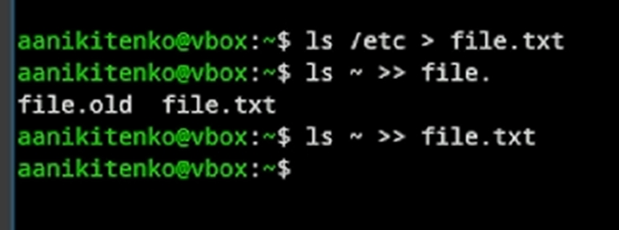
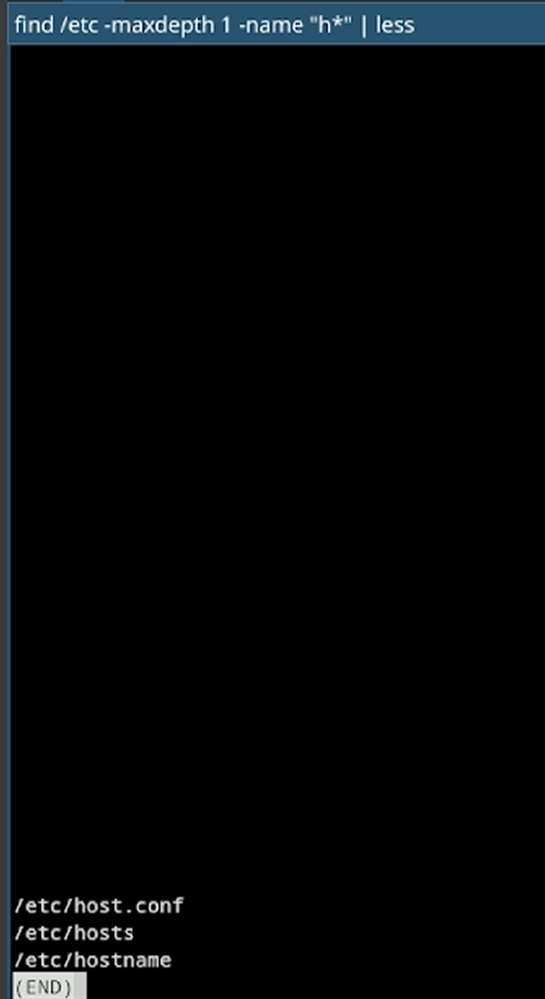
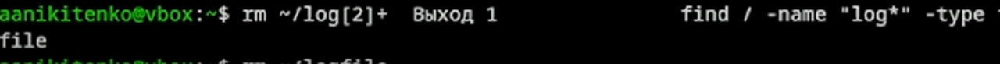
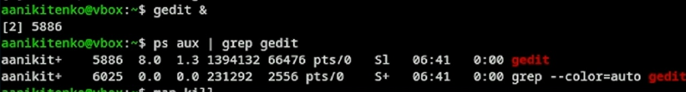

---
## Front matter
lang: ru-RU
title: Отчет по лабораторной работе №9
subtitle: Операционные системы
author:
  -  Никитенко Арина Александровна
institute:
  - Российский университет дружбы народов, Москва, Россия

## i18n babel
babel-lang: russian
babel-otherlangs: english

## Formatting pdf
toc: false
toc-title: Содержание
slide_level: 2
aspectratio: 169
section-titles: true
theme: metropolis
header-includes:
 - \metroset{progressbar=frametitle,sectionpage=progressbar,numbering=fraction}
---

# Информация

## Докладчик

  * Никитенко Арина Александровна
  * НКАбд-07-25, Студенческий билет: 1132250435
  * Российский университет дружбы народов

## Цель работы

Освоить основные возможности командной оболочки Midnight Commander. Приоб-
ретести навыки практической работы по просмотру каталогов и файлов; манипуляций
с ними.
---

## Выполнение лабораторной работы

##

1.1 Запускаем из командной строки mc, изучаем его структуру и меню.

{#fig-001 width=70%}

##
1.2 Выполняем несколько операций в mc, используя управляющие клавиши (операции
с панелями; выделение/отмена выделения файлов, копирование/перемещение фай-
лов, получение информации о размере и правах доступа на файлы и/или каталоги
и т.п.)

{#fig-002 width=70%}

##

1.3 Выполняем основные команды меню левой (или правой) панели. Оценмваем степень
подробности вывода информации о файлах.

{#fig-003 width=70%}

##

1.4 Используя возможности подменю Файл , выполняем: просмотр содержимого текстового файла;
– редактирование содержимого текстового файла (без сохранения результатов
редактирования);
– создание каталога;
– копирование в файлов в созданный каталог.

![1. Меню «Файл» (F9 → Файл) 1. Просмотр (F3): выделите любой текстовый файл → F3 (откроется для чтения). Выйти — F10 (или Esc дважды). 2. Редактирование (F4): F4 на файле (откроется редактор). Выйти без сохранения: Shift + F10 или «Выход» → «Нет». 3. Создание каталога (F7): F7 → введите test_dir → Enter. 4. Копирование файлов (F5): выделите файл (или несколько через Insert) → F5 → в появившемся окне допишите в конце /test_dir (или Enter, если вторая панель уже открыта на test_dir) → опишите эти 4 шага и приложите скриншоты.](image/4.png){#fig-004 width=70%}

##

1.5  помощью соответствующих средств подменю Команда осуществляем:
– поиск в файловой системе файла с заданными условиями (например, файла
с расширением .c или .cpp, содержащего строку main);
– выбор и повторение одной из предыдущих команд;
– переход в домашний каталог;
– анализ файла меню и файла расширений

![1. Меню Команда (F9 → Команда) - Поиск файла: выберите «Поиск файла». Имя файла: *.c (или *.txt). Содержит: main (или любое слово). Нажмите «OK». mc покажет найденные файлы. - История командной строки: выберите пункт. Увидите список последних команд, введённых в терминал. - Переход в домашний каталог: Ctrl + \ (обратный слэш) → выберите ~ (или home). - Анализ файлов: Файл расширений: F9 → Команда → Редактировать файл расширений. Откроется конфиг, где написано, чем открывать .jpg или .html (просто посмотрите, не меняйте). Файл меню: F9 → Команда → Редактировать файл меню. Это то, что появляется по F2 (пользовательские скрипты).](image/5.png){#fig-005 width=70%}

##

1.6 Вызоваем подменю Настройки . Осваиваем операции, определяющие структуру экрана mc
(Full screen, Double Width, Show Hidden Files и т.д.)

![ Меню Настройки (F9 → Настройки) - Конфигурация: зайдите и отметьте/снимите «Показывать скрытые файлы» (. — точки в начале). Примените. Скрытые файлы (.bashrc) появятся/исчезнут. - Подтверждение: посмотрите, какие действия запрашивают подтверждение (удаление, перезапись). - Внешний вид: попробуйте поменять цветовую схему (скин) или расположение панелей (вертикально/горизонтально). - Что писать: «В настройках можно включить отображение скрытых файлов, отключить подтверждение удаления (опасно!) или сменить цветовую схему».](image/6.png){#fig-006 width=70%}

##
1.7 Cоздаём текстовой файл text.txt, Bставляем в открытый файл небольшой фрагмент текста, скопированный из любого другого файла или Интернета.

{#fig-007 width=70%}

##

1.8 Проделаем с текстом следующие манипуляции, используя горячие клавиши:1. Удаляем строку текста.

{#fig-008 width=70%}

##

1.9 Bыделяем фрагмент текста и скопируем его на новую строку.

{#fig-009 width=70%}

##

1.10 Отменяем последнее действие.

{#fig-010 width=70%}

##

1.11 Переходим в конец файла (нажав комбинацию клавиш) и пишем некоторый
текст.Переходим в начало файла (нажав комбинацию клавиш) и пишем некоторый
текст.

{#fig-011 width=70%}

##

Вывод Мы освоили основные возможности командной оболочки Midnight Commander. Приоб-
рели навыки практической работы по просмотру каталогов и файлов; манипуляций
с ними.

##

#Контрольные вопросы

1. Режимы работы панелей mc. В Midnight Commander панели могут работать в нескольких режимах. Стандартный режим (Standard) отображает имя файла, размер и время модификации. Укороченный режим (Brief) показывает только имена файлов в две колонки. Расширенный режим (Long) выводит подробную информацию, аналогичную команде ls -l (права доступа, владелец, группа). Режим, определяемый пользователем (User), позволяет гибко настраивать отображение полей. Режим Информация (Info) выводит на панель данные о выделенном файле и файловой системе. Режим Дерево (Tree) отображает древовидную структуру каталогов. Режим Быстрого просмотра (Quick View) показывает содержимое выделенного текстового файла.

2. Операции с файлами: shell и меню mc. Большинство операций можно выполнить как стандартными командами оболочки в строке ввода mc, так и через меню или горячие клавиши. Например, копирование: команда cp source dest или клавиша F5. Перемещение: mv source dest или F6. Удаление: rm file или F8. Создание каталога: mkdir dir или F7. Просмотр прав доступа: команда ls -l или сочетание Ctrl + x c для изменения прав (chmod). Смена владельца: chown user:group file или Ctrl + x o. Создание символической ссылки: ln -s target link или Ctrl + x s.

##

3. Структура меню левой (или правой) панели mc. Меню панели открывается по F9 → Left/Right. Команда "Формат списка" (Listing Mode) переключает режим отображения панели (Стандартный, Укороченный, Расширенный, Определяемый пользователем). "Порядок сортировки" (Sort Order) задает критерий сортировки по имени, расширению, размеру или времени, а также направление. "Фильтр" (Filter) позволяет отображать только файлы, соответствующие маске (например, *.txt). "Перечитать" (Reread) обновляет содержимое панели (Ctrl + r).

4. Структура меню Файл mc. Меню "Файл" (File) содержит основные операции. "Просмотр" (F3) — просмотр текущего файла. "Редактирование" (F4) — открытие файла во встроенном редакторе mcedit. "Копирование" (F5) — копирование файлов и папок. "Перемещение" (F6) — перемещение или переименование. "Создание каталога" (F7). "Удаление" (F8). "Права доступа" (Ctrl + x c) — изменение прав (chmod). "Владелец/группа" (Ctrl + x o) — смена владельца (chown).

##

5. Структура меню Команда mc. Меню "Команда" (Command) предоставляет дополнительные утилиты. "Дерево каталогов" отображает структуру каталогов. "Поиск файла" (Alt + ?) — мощный поиск по имени и содержимому. "Справочник каталогов" (Hotlist) (Ctrl + \) — быстрый доступ к избранным каталогам. "Критерий панелизации" (External panelize) позволяет вывести результат выполнения внешней команды (например, find) прямо на панель mc. "Редактировать файл меню" открывает для правки файл пользовательского меню, вызываемого по F2.

6. Структура меню Настройки mc. Меню "Настройки" (Options) отвечает за внешний вид и поведение. "Конфигурация" (Configuration) — основные настройки, включая использование встроенного редактора, поддержку мыши и подсветку синтаксиса. "Внешний вид" (Appearance) — выбор темы оформления (скина), настройка цветов и шрифтов. "Подтверждения" (Confirmation) — настройка запросов подтверждения на опасные действия (удаление, перезапись). "Распознавание клавиш" (Learn Keys) — ручное назначение клавиш.

##

7. Встроенные команды mc. Помимо стандартных F1-F10, есть и другие команды. Tab переключает между панелями. Insert или Ctrl + t отмечает файл. + (плюс) выделяет группу файлов по маске. Ctrl + \ открывает список быстрых переходов (hotlist). Ctrl + o сворачивает mc и попадает в командную строку оболочки. Ctrl + l перерисовывает экран. Alt + . (точка) показывает или скрывает скрытые файлы.

8. Команды встроенного редактора mc (mcedit). Редактор вызывается по F4. F2 сохраняет файл. Shift + F3 включает вертикальное выделение текста (блочный режим). F7 выполняет поиск по тексту. F4 — поиск и замена. Alt + t сортирует выделенные строки. Ctrl + u отменяет последнее действие (Undo). Ctrl + Space запускает проверку орфографии. Alt + Tab — автодополнение слова.

##

9. Средства mc для создания пользовательского меню. mc позволяет создавать собственные меню с часто используемыми действиями. Оно вызывается клавишей F2. Пункты меню прописываются в файле ~/.config/mc/menu (или ~/.mc/menu). Формат записи: сначала заголовок в квадратных скобках, затем команды оболочки для выполнения. В файл можно включать условные записи, которые проверяют расширение файла или его тип, отображая разные пункты меню для разных ситуаций.

10. Средства mc для выполнения действий над текущим файлом. Для выполнения действий, определяемых пользователем, над текущим файлом используется пользовательское меню (F2), настроенное через файл ~/.config/mc/menu. В пунктах этого меню можно использовать специальные макроподстановки: %f подставляется полное имя текущего файла, %p — имя текущего файла без пути, %d — текущий каталог, %s — выделенные файлы. Например, можно создать пункт меню для автоматической архивации текущего файла: tar -czf %f.tar.gz %f или для просмотра его контрольной суммы: md5sum %f.

 
