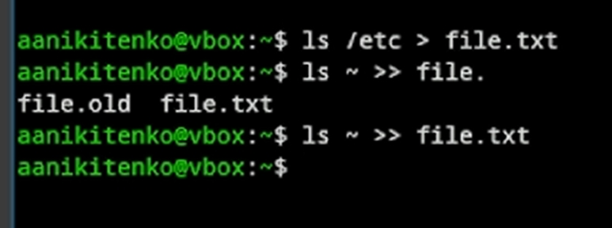
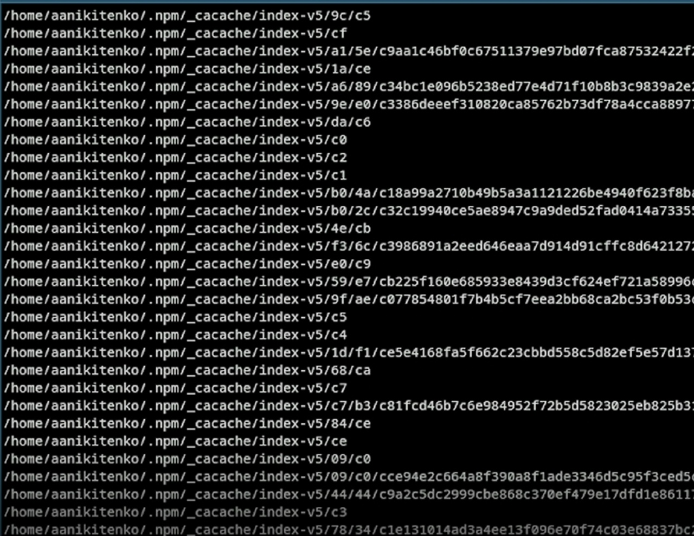
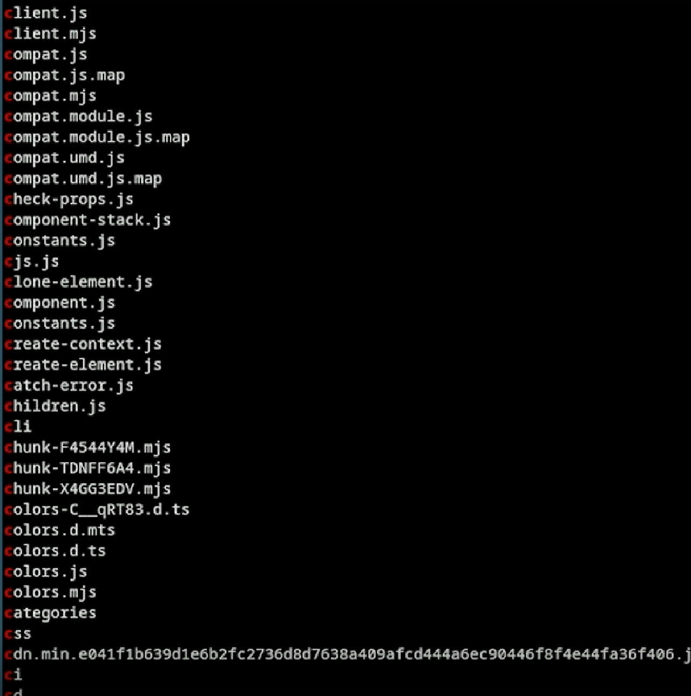
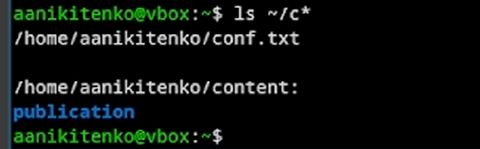
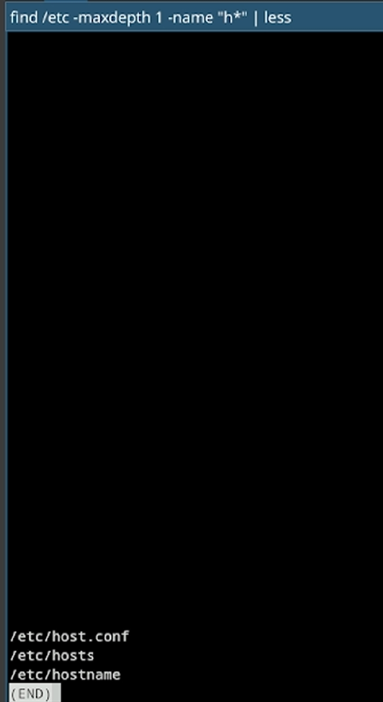
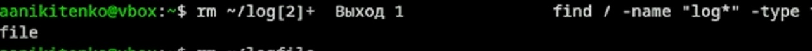
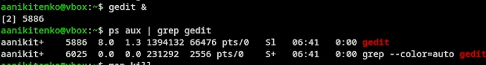
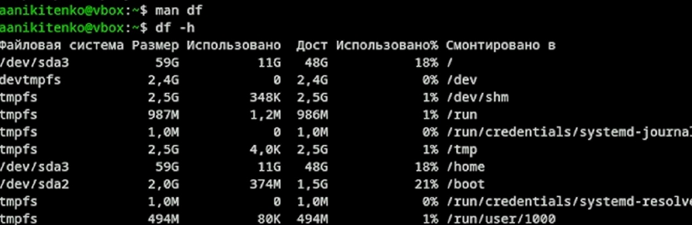
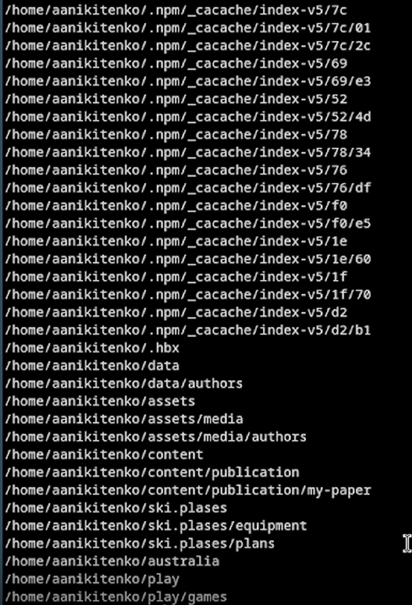

---
## Author
author:
  name: Никитенко Арина 
  degrees: DSc
  orcid: 0000-0002-0877-7063
  email: 1132250435@rudn.ru
  affiliation:
    - name: Российский университет дружбы народов
      country: Российская Федерация
      postal-code: 117198
      city: Москва
      address: ул. Миклухо-Маклая, д. 6

## Title
title: "Отчёт лабараторная работа №8"
subtitle: "Архитектура компьютеров и операционные системы "
license: "CC BY"
---

# Цель работы

Ознакомится  с инструментами поиска файлов и фильтрации текстовых данных.
Приобрести практические навыки: по управлению процессами (и заданиями), по
проверке использования диска и обслуживанию файловых систем

# Задание

# 1.1 Запишем в файл file.txt названия файлов, содержащихся в каталоге /etc. 
Допишем в этот же файл названия файлов, содержащихся в  домашнем каталоге.

{#fig-001 width=70%}

# 1.2 Поиск файлов с расширением .conf и запишем в conf.txt

{#fig-002 width=70%}

# 1.3 Поиск файлов в домашнем каталоге,начинающихся с с

{#fig-003 width=70%}

{#fig-004 width=70%}

{#fig-005 width=70%}

{#fig-006 width=70%}

# 1.4 Постраничный вывод файлов из /etc , начинающихся с h

{#fig-007 width=70%}

# 1.5 Запуск в фоновом режиме записи файлов с именем,начинающимся на log в ~/logfile

{#fig-008 width=70%}

#1.6 Удаление файла ~/logfile

{#fig-009 width=70%}

#1.7 Запуск gedit в фоновом режиме и определение  PID процесса gedit

{#fig-010 width=70%}

#1.8 Завершение процесса gedit с помощбю kill

{#fig-011 width=70%}

#1.9 Команда df

{#fig-012 width=70%}

#1.10 Команда du

{#fig-013 width=70%}

#1.11 Вывод имён всех директорий в домашнем каталоге

{#fig-014 width=70%}

# Вывод

Мы ознакомились  с инструментами поиска файлов и фильтрации текстовых данных.
Также мы приобрели практические навыки: по управлению процессами (и заданиями), по
проверке использования диска и обслуживанию файловых систем

# Контрольные вопросы

1. Какие потоки ввода-вывода вы знаете?
В Linux существует три стандартных потока ввода-вывода: stdin (0) — стандартный ввод (обычно клавиатура), stdout (1) — стандартный вывод (обычно экран), stderr (2) — стандартный вывод ошибок (обычно экран).

2. Объясните разницу между операцией > и >>.
Операция > выполняет перенаправление с перезаписью файла (создает новый файл или перезаписывает существующий), а операция >> выполняет перенаправление с добавлением (дописывает данные в конец файла, не удаляя существующее содержимое).

3. Что такое конвейер?
Конвейер (|) — это механизм, передающий вывод одной команды на ввод другой, что позволяет создавать цепочки обработки данных, например: cat file.txt | grep "ошибка" | less.

4. Что такое процесс? Чем это понятие отличается от программы?
Процесс — это экземпляр программы во время выполнения, у которого есть свой ID, память и ресурсы, в то время как программа — это статичный набор инструкций, хранящийся на диске.

5. Что такое PID и GID?
PID — это уникальный числовой идентификатор процесса, а GID — идентификатор группы процесса или реальный идентификатор группы пользователя.

6. Что такое задачи и какая команда позволяет ими управлять?
Задачи — это процессы, запущенные внутри текущей сессии терминала. Управляет ими команда jobs, а также комбинации клавиш Ctrl+Z (приостановить), fg (вернуть на передний план), bg (запустить в фоне) и символ & для запуска программы сразу в фоне.

7. Найдите информацию об утилитах top и htop. Каковы их функции?
Утилита top — это стандартный интерактивный диспетчер задач, показывающий список процессов, загрузку CPU, памяти и swap в реальном времени, а htop — это улучшенная версия top с цветным интерфейсом, возможностью прокрутки, управлением мышью и более удобным завершением процессов.

8. Назовите и дайте характеристику команде поиска файлов. Приведите примеры использования этой команды.
Команда поиска файлов — find, которая рекурсивно обходит каталоги и ищет файлы по условиям (имя, размер, дата, права доступа). Примеры использования: find /home -name "*.txt" (найти все txt-файлы в home), find . -type f -size +100M (найти файлы больше 100 Мб в текущей папке), find /var/log -mtime -1 (файлы, измененные за последние 24 часа).

9. Можно ли по контексту (содержанию) найти файл? Если да, то как?
Да, файл можно найти по контексту (содержанию) с помощью команды grep: например, grep -r "искомый текст" /путь/к/каталогу или find . -name "*.py" -exec grep "import os" {} .

10. Как определить объем свободной памяти на жёстком диске?
Объем свободной памяти на жестком диске определяется командой df -h (в человекочитаемом виде) или df -i (для проверки свободных инодов).

11. Как определить объем вашего домашнего каталога?
Объем домашнего каталога определяется командой du -sh ~ (общий размер) или du -h ~ --max-depth=1 (размер каждой папки внутри).

12. Как удалить зависший процесс?
Чтобы удалить зависший процесс, нужно сначала найти его PID командами ps aux | grep "имя_процесса", pgrep -l "имя" или через top/htop, а затем отправить сигнал на завершение: kill PID (сигнал SIGTERM — вежливая просьба завершиться) или kill -9 PID (сигнал SIGKILL — принудительное убийство процессом ядра), также можно использовать killall -9 имя_процесса или в htop нажать F9, выбрать SIGKILL и нажать Enter.

 
::: {#refs}
:::

