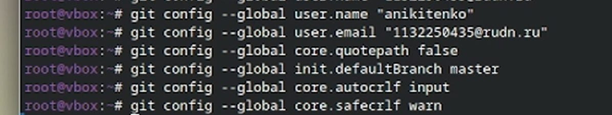
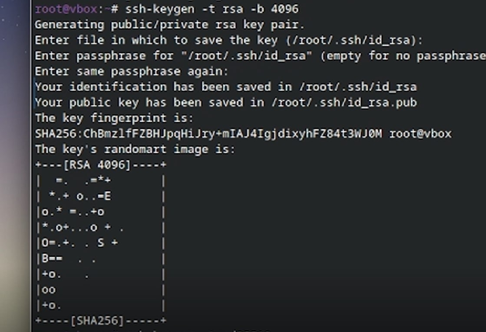
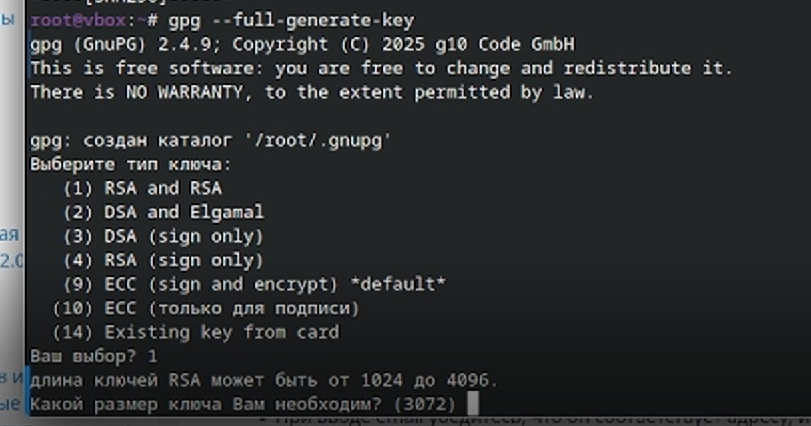
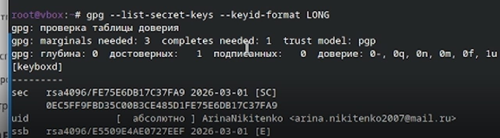
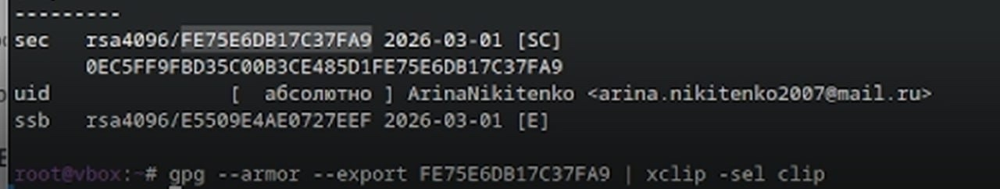
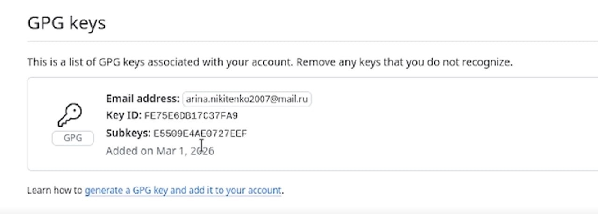
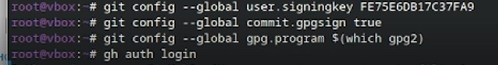
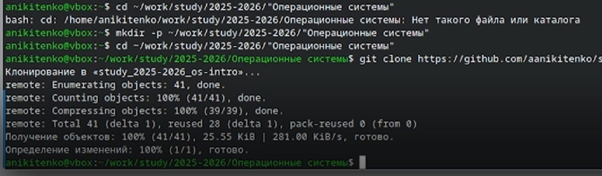
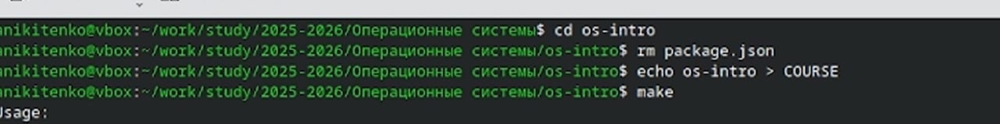
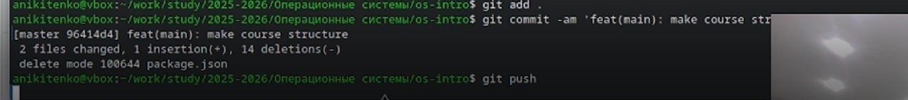

---
## Author
author:
  name: Никитенко Арина Александровна
  degrees: DSc
  orcid: 0000-0002-0877-7063
  email: 1132250435@rudn.ru
  affiliation:
    - name: Российский университет дружбы народов
      country: Российская Федерация
      postal-code: 117198
      city: Москва
      address: ул. Миклухо-Маклая, д. 6

## Title
title: "Отчёт по лабораторной работе №2"
license: "CC BY"
---

# Цель работы

Целью данной работы является изучение идеологии и применения средств контроля версий. И освоение умений работать с git.

# Выполнение лабораторной работы

1.Устанавливаем git,gh.

{ #fig:001 width=70%  }

{ #fig:002 width=70%  }

2.Зададим имя и email владельца репозитория, кодировку и прочие параметры.

{ #fig:003 width=70%  }

3.Создаем SSH ключи

{ #fig:004 width=70%  }

4.Создаем GPG ключ

{ #fig:005 width=70%  }

5.Добавляем GPG ключ в аккаунт

{ #fig:006 width=70% }

{ #fig:007 width=70% }

{ #fig:008 width=70%  }

6.Настройка автоматических подписей коммитов git и настройка gh

{ #fig:009 width=70%  }

7.Загрузка шаблона репозитория и синхронизация

{ #fig:010 width=70%  }

8.Настройка каталога курса

{ #fig:011 width=70% }

{ #fig:012 width=70%  }

# Вывод

Мы приобрели практические навыки работы с сервисом github.

#Контрольные вопросы

1.Система контроля версий (VCS) — это инструмент для отслеживания изменений в файлах. Нужна для: хранения истории изменений, возможности отката к любой версии, организации совместной работы над проектом, анализа изменений и параллельной разработки (ветвления).

2. Хранилище (Repository): База данных проекта, где хранятся все файлы и вся история изменений.

Commit (Фиксация): "Снимок" состояния проекта в текущий момент времени с описанием изменений.

История (History): Цепочка коммитов, показывающая, как развивался проект.

Рабочая копия (Working Copy): Файлы проекта на вашем компьютере, с которыми вы работаете в данный момент.

3. Централизованные (CVCS): Один главный сервер с историей. Разработчики имеют только рабочие копии. Требуют подключения к сети. Примеры: SVN, CVS.

Децентрализованные (DVCS): Каждый разработчик имеет полную копию хранилища (включая историю) на своем ПК. Можно работать офлайн. Примеры: Git, Mercurial.

4. Действия при единоличной работе
Создать локальное хранилище (git init).

Создать/изменить файлы в рабочей копии.

Добавить файлы для отслеживания (git add).

Зафиксировать изменения (сделать commit) с комментарием (git commit).

5. Порядок работы с общим хранилищем
Клонировать (Clone) удаленное хранилище к себе на компьютер.

Внести изменения в рабочую копию.

Добавить изменения в индекс (add) и закоммитить (commit) их локально.

Забрать (Pull/Fetch) последние изменения из общего хранилища (на случай, если кто-то обновил его раньше).

Отправить (Push) свои коммиты в общее хранилище.

6. Основные задачи Git
Управление версиями проекта.

Ведение нелинейной истории разработки (ветвление).

Обеспечение распределенной работы (полная копия репозитория у каждого).

Объединение изменений от разных разработчиков.

7. Основные команды Git (кратко)
git init — создать новый репозиторий в текущей папке.

git add <file> — добавить файл в список отслеживаемых для будущего коммита.

git commit -m "message" — создать коммит с описанием.

git push — отправить свои коммиты в удаленный репозиторий.

git pull — скачать новые изменения из удаленного репозитория.

git log — посмотреть историю коммитов.

git branch — посмотреть список веток или создать новую.

8. Примеры работы с репозиториями
Локальный: git init -> git add index.html -> git commit -m "Add main page".

Удаленный: git clone  -> (правим файлы) -> git add . -> git commit -m "Fix bug" -> git push origin main.

9. Ветви (Branches)
Ветка — это отдельная линия разработки. Она позволяет работать над новыми фичами или исправлениями изолированно от основного кода, чтобы не "сломать" стабильную версию. Позже доработанную ветку можно слить (merge) обратно в основную.

10. Игнорирование файлов (.gitignore)
Некоторые файлы (временные, логи, конфиги с паролями, папки node_modules) не нужно хранить в репозитории. Для их игнорирования создается файл .gitignore. В него записываются шаблоны имен файлов/папок, которые Git должен пропускать при добавлении (add).
