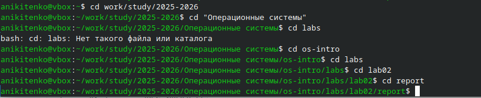
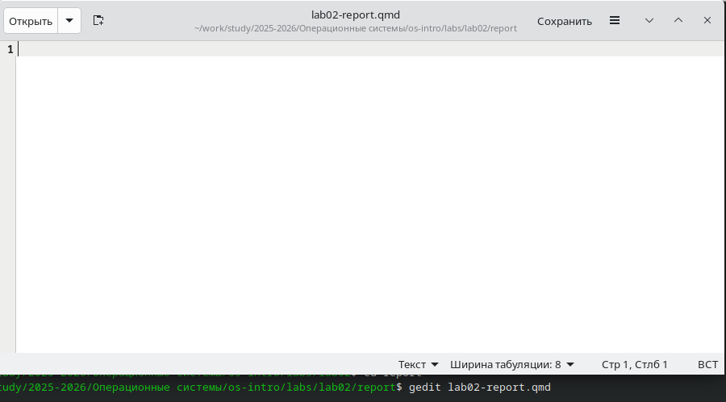
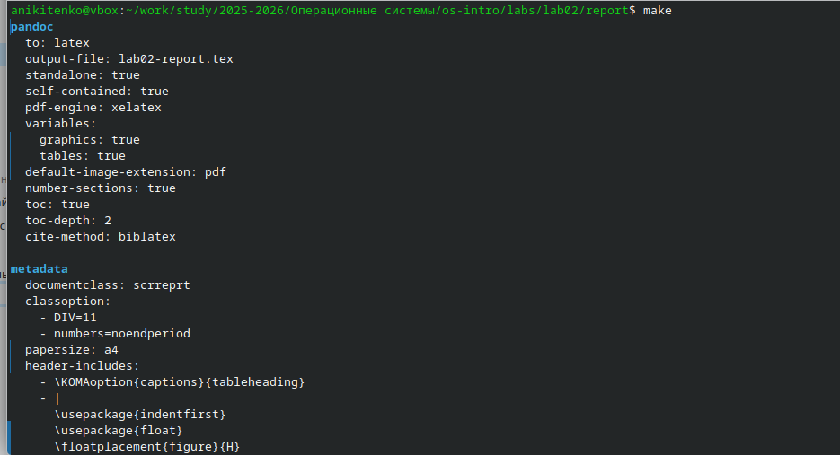
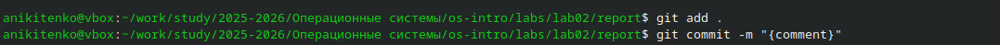
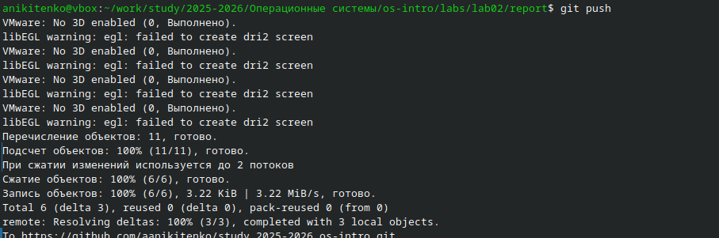

---
## Author
author:
  name: Никитенко Арина 
  degrees: DSc
  orcid: 0000-0002-0877-7063
  email: 1132250435@rudn.ru
  affiliation:
    - name: Российский университет дружбы народов
      country: Российская Федерация
      postal-code: 117198
      city: Москва
      address: ул. Миклухо-Маклая, д. 6

## Title
title: "Отчёт лабараторная работа №3"
subtitle: "Архитектура компьютеров и операционные системы "
license: "CC BY"
---

# Цель работы

Научиться оформлять отчёты с помощью языка разметки Markdown

# Задание

1.Переходим в каталог, где находится шаблон для отчёта

{#fig-001 width=70%}

2.Открытие файла с помощью редактора Gedit и изменение его

{#fig-002 width=70%}

3.После такого, как мы отредактировали шаблон отчёта, выполняем компеляцию из формата qmd в pdf,docx

{#fig-003 width=70%}

4.Отправляем созданные и скомпелированные файлы на глобальный репозиторий 

{#fig-004 width=70%}

5.Отправка с помощью команды git push

{#fig-005 width=70%}

# Выводы

Мы научились оформлять отчёты с помощью Markdown

::: {#refs}
:::
